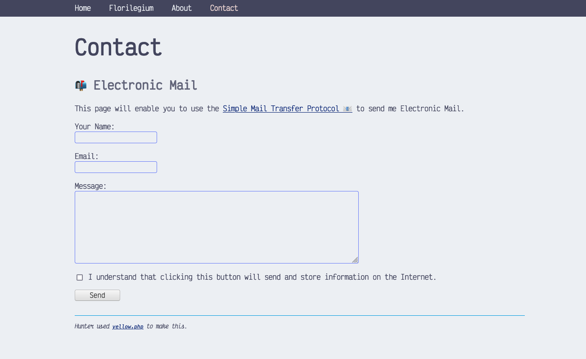

<a href="README-de.md">Deutsch</a> &nbsp; <a href="README.md">English</a> &nbsp; <a href="README-sv.md">Svenska</a>

# Loveland 0.9.2

Loveland is a [catpuccinian](https://github.com/catppuccin/catppuccin) fork of Anna Svennson's [Berlin](https://github.com/annaesvensson/yellow-berlin).

## How to install an extension

You're in the wrong place for information about that; [go upstream!](https://github.com/annaesvensson/yellow-update).

I don't know if this will work! I just changed the css and then crudely hit find and replace until all the `berlin`s said `loveland`.

## Acknowledgements

Includes [VictorMono](https://rubjo.github.io/victor-mono/).

Thank you, Anna Svensson, for the original, even more minimalistic [design and underlying system](https://datenstrom.se/yellow/).
